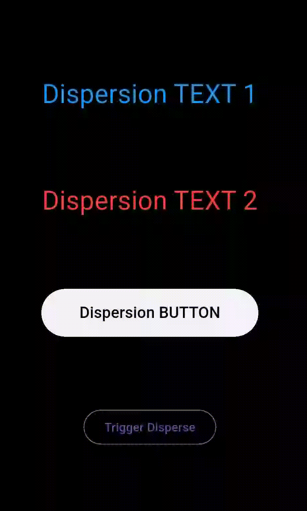

# Dispersable Widget

`dispersable_widget` is a Flutter package for creating visually stunning particle dispersal animations on any widget. It lets you animate a widget "breaking apart" into colored particles with full control over speed, density, particle size, distortion area, and even sound effects.

Perfect for splash screens, button effects, or playful UI destruction effects in onboarding, games, or fun apps.


## ✨ Features
- **Customizable Particle Dispersal**: Control particle size, speed, density, and dispersion area.
- **Any Widget Support:**: Works with any Flutter widget — buttons, images, text, containers, etc.
- **Sound Effects**: Optional audio playback on dispersal for immersive UX.
- **High Performance**: Optimized for efficient animation with low memory and CPU usage.
- **Clean Exit Callbacks**: Execute cleanup or UI state change with `onComplete`.

## Installation
To use `dispersable_widget`, add it to your `pubspec.yaml` file:

```yaml
dependencies:
  dispersable_widget: ^1.0.0
```
```yaml
    flutter pub get
```

## Usage
```
import 'package:flutter/material.dart';
import 'package:dispersable_widget/dispersable_widget.dart';

class ExampleApp extends StatefulWidget {
  @override
  _ExampleAppState createState() => _ExampleAppState();
}

class _ExampleAppState extends State<ExampleApp> {
  bool _disperse = false;

  @override
  Widget build(BuildContext context) {
    return Scaffold(
      backgroundColor: Colors.black,
      body: Center(
        child: Column(
          mainAxisAlignment: MainAxisAlignment.center,
          children: [
            GestureDetector(
              onTap: () {
                setState(() {
                  _disperse = !_disperse;
                });
              },
              child: DispersableWidget(
                disperse: _disperse,
                duration: Duration(seconds: 2),
                particleConfig: ParticleConfig(
                  speed: 4.0,
                  size: 2.0,
                  particleDensity: 3,
                  particleArea: Rect.fromLTWH(0, 0, 300, 300),
                ),
                onComplete: () => print('Animation completed!'),
                child: Text(
                  'Dispersable Widget',
                  style: TextStyle(fontSize: 30, color: Colors.white),
                ),
              ),
            ),
          ],
        ),
      ),
    );
  }
}
```



## 🛠️ Parameters

### `DispersableWidget`

| Parameter        | Type             | Description                                                              |
|------------------|------------------|--------------------------------------------------------------------------|
| `child`          | `Widget`         | The widget that will be animated/dispersed.                              |
| `disperse`       | `bool`           | Triggers the dispersal animation.                                        |
| `duration`       | `Duration`       | Duration of the dispersal animation. Default: `1200ms`.                  |
| `enable_sound`       | `bool`           | Triggers the Sound Effect if enable animation.                                        |
| `particleConfig` | `ParticleConfig` | Configuration for particle behavior (see below).                         |
| `onComplete`     | `VoidCallback?`  | Optional callback called after dispersal completes.                      |


### `ParticleConfig`

| Parameter         | Type      | Description                                                                 |
|------------------|-----------|-----------------------------------------------------------------------------|
| `speed`          | `double`  | Speed of particle movement. Default: `4.0`.                                |
| `size`           | `double`  | Size of each particle. Default: `1.0`.                                     |
| `particleDensity`| `int`     | Controls particle count; lower value creates more particles. Default: `2`. |
| `spread` | `double?`   | Control the spread area of particles. Default: full widget size. |


# Contact
- **Lindedin**: [Fahad Aziz Khan](https://www.linkedin.com/in/fahad-aziz-khan-2a1723261/)
- **GitHub**: [fahadazizz](https://github.com/fahadazizz)


